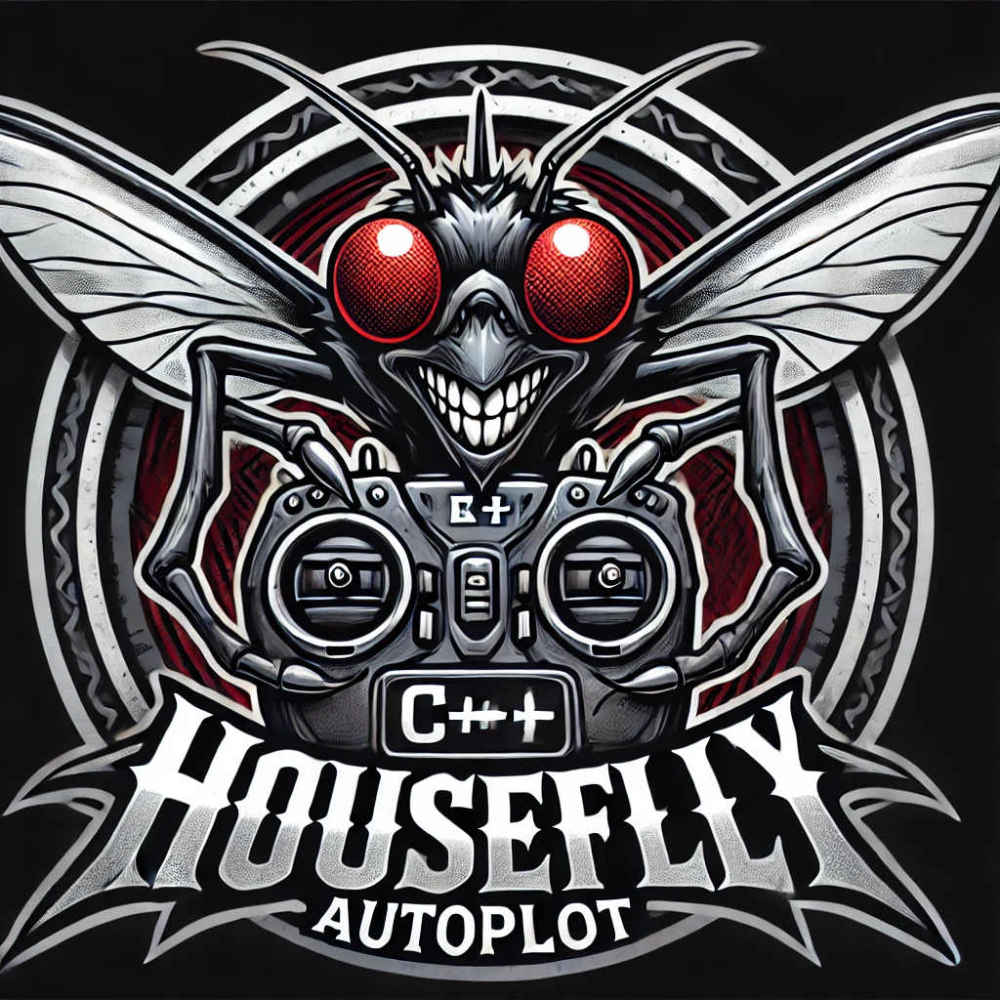

# Housefly Autopilot

In a simple drone (quadcopter), a pilot only controls the speed of the motors. By adjusting the motors' speed individually, they can maneuver the flying vehicle. In the real world, pilots make each action based on the perceived result of their previous actions until the goal is achieved. An autopilot’s perception is based on sensor data, such as angle, position, altitude, etc.

> 🔍 Explore more
> You can read more about **Housefly Autopilot Library** here
> [Housefly Autopilot Library](https://github.com/shahrokni/housefly-lab/blob/main/housefly-autopilot/README.md)

# What is Housefly Drone?

The Housefly Drone is a prototype drone designed specifically for research and development of autopilot systems. It focuses on providing a stable, lightweight, and cost-effective platform for testing autonomous flight capabilities indoors. The Housefly Drone emphasizes simplicity, functionality, and safety, making it an ideal choice for prototyping and developing cutting-edge autopilot systems.

> 🔍 Explore more
> You can read more about **Housefly Drone** here
> [Housefly Drone](https://github.com/shahrokni/housefly-lab/blob/main/housefly-drone/README.md)

# What is ATC?

In the context of the `Housefly Lab`, the `ATC` refers to any form of electromagnetic transmission control used to send signals and instructions to the `Housefly Drone`. Unlike traditional aviation definitions, communication between the so-called tower and the flying vehicle in this setup is unilateral, flowing only from the ATC to the drone.

## ATC Instructions

The ATC is capable of sending instructions to the drone. This process is unilateral, meaning the ATC does not receive any updates on the sent instructions. Since instructions may change the internal state of the drone's autopilot, except for emergency instructions, their execution is not guaranteed. The instructions are divided into three categories.

- Safe Instructions (SI): These do not affect the autopilot state machine. Example: `ECHO`
- Critical Instructions (CI): These affect the autopilot state machine. Example: `LAND`
- Emergency Instructions (EI): These are executed immediately by the drone, regardless of the current state. Example: `HALT`

